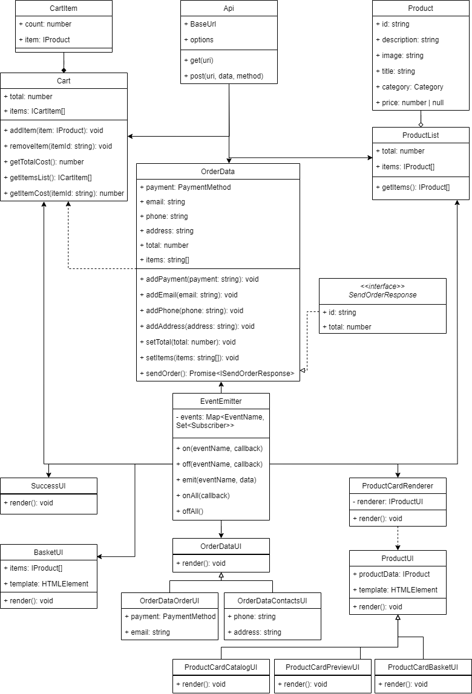

# Проектная работа "Веб-ларек"

**Стек**: HTML, SCSS, TS, Webpack

## Структура проекта:
- `src/` — исходные файлы проекта
- `src/components/` — папка с JS компонентами
- `src/components/base/` — папка с базовым кодом

### Важные файлы:
- `src/pages/index.html` — HTML-файл главной страницы
- `src/types/index.ts` — файл с типами
- `src/index.ts` — точка входа приложения
- `src/styles/styles.scss` — корневой файл стилей
- `src/utils/constants.ts` — файл с константами
- `src/utils/utils.ts` — файл с утилитами

## Установка и запуск
Для установки и запуска проекта необходимо выполнить команды:

```bash
npm install
npm run start
```

или

```bash
yarn
yarn start
```

## Сборка

```bash
npm run build
```

или

```bash
yarn build
```

## Архитектура

### Обновление
В процессе реализации представленной архитектуры ряд компонентов был модернизирован или исправлен:
- Компоненты моделей данных были преобразованы в одну модель `AppState` для упрощения организации событийно-ориентированной системы.
- Выделены отдельные классы-конструкторы, наследующиеся от класса `Component`, принимающие темплейт и выполняющие с ним операции по установке текста, изображений и т.д.
- Пересмотрена организация UI-компонентов: теперь есть отдельно представление всей страницы `Page` и модульного окна `Modal`, куда встраиваются темплейты корзины, оформления заказа и т.д.



## Описание базовых классов

1. **Класс `Api`**  
   Класс `Api` предоставляет методы для работы с сервером:

   - `get` — для выполнения GET-запросов.
   - `post` — для отправки данных через POST, PUT или DELETE.

   **Конструктор**:  
   Принимает:
   - `baseUrl` — базовый URL для всех запросов.
   - `options` — настройки запросов, включая заголовки по умолчанию (`Content-Type: application/json`).

   **Методы**:
   - `get(uri)` — выполняет GET-запрос по указанному URI.
   - `post(uri, data, method = 'POST')` — отправляет данные на сервер с использованием POST, PUT или DELETE.

   Оба метода возвращают промис, который при успешном ответе возвращает JSON-объект, а при ошибке — сообщение об ошибке.

2. **Класс `EventEmitter`**  
   Класс `EventEmitter` реализует механизм брокера событий, используя паттерн Наблюдатель (Observer). Он позволяет объектам подписываться на события и уведомляет их, когда эти события происходят.

   При создании объекта класса `EventEmitter`, конструктор инициализирует объект типа `Map`, где:
   - Ключами выступают названия событий (или шаблоны событий),
   - Значениями — `Set` (множество) с подписчиками, то есть функциями, которые будут вызываться при возникновении соответствующего события.

   Класс реализует интерфейс `IEvents` и предоставляет следующие основные методы:

   - `on(eventName, callback)` — подписывает на событие:
     принимает название события и функцию-обработчик (`callback`), которая будет вызвана при возникновении этого события. Например, это может быть функция для обновления пользовательского интерфейса.

   - `off(eventName, callback)` — отменяет подписку:
     позволяет удалить функцию-обработчик (`callback`) с определённого события. Если все подписчики удалены, событие также удаляется из списка.

   - `emit(eventName, data)` — генерирует событие:
     принимает название события и данные, которые будут переданы подписчикам. Вызывает все функции-обработчики, зарегистрированные на это событие. Аргумент `data` является опциональным и может отсутствовать.

   **Дополнительные методы**:
   - `onAll(callback)` — подписывает функцию на все события. Функция будет вызываться каждый раз, когда происходит любое событие.
   - `offAll()` — удаляет всех подписчиков всех событий. Полностью очищает список зарегистрированных событий и обработчиков.
   - `trigger(eventName, context)` — создаёт функцию для отложенной генерации события:
     Работает как `emit`, но возвращает функцию, которая генерирует событие при вызове. Это позволяет создавать "триггеры", которые можно использовать позднее для многократной генерации одного и того же события с предустановленными параметрами.

## Компоненты модели данных (бизнес-логика)

1. **Класс `Product`**  
   Класс, реализующий объекты конкретных товаров. Включает такие свойства, как `id`, `description`, `image`, `title`, `category` и `price`.  
   `category` ограничен списком:
   ```typescript
   enum Category {
     SoftSkill = "софт-скил",
     HardSkill = "хард-скил",
     Button = "кнопка",
     Another = "другое",
     Additional = "дополнительное",
   }
   ```

2. **Класс `ProductList`**  
   Класс, аккумулирующий все продукты в виде массива `items`. Позволяет получать список продуктов для продажи с помощью метода `getItems`.

3. **Класс `Cart`**  
   Класс, представляющий информацию о продуктах, добавленных в корзину, и их суммарной стоимости. Реализует методы:
   - `addItem`: добавление товара,
   - `removeItem`: удаление товара,
   - `getTotalCost`: получение итоговой цены,
   - `getItemsList`: получение перечня товаров в корзине.

4. **Класс `CartItem`**  
   Класс для хранения информации о конкретном продукте в корзине, включая данные о продукте и количестве единиц товара в корзине.

5. **Класс `OrderData`**  
   Класс, реализующий модель данных о заказе пользователя (например, `payment`, `email`, `phone` и т.д.). Реализован с использованием паттерна Builder, что позволяет поэтапно добавлять свойства и отправлять заказ на сервер.

## Компоненты представления данных

1. **Классы `ProductUI`, `ProductCardCatalogUI`, `ProductCardPreviewUI`, `ProductCardBasketUI`**  
   Класс `ProductUI` имплементирует интерфейс `IProductUI`, а классы `ProductCardCatalogUI`, `ProductCardPreviewUI` и `ProductCardBasketUI` наследуют его. Эти классы реализуют паттерн "Стратегия", когда класс `ProductCardRenderer` выбирает нужную стратегию отображения карточки в зависимости от шаблона. Каждый из них содержит данные о продукте и метод `render`, который заполняет шаблон данными.

2. **Класс `ProductCardRenderer`**  
   Класс для выбора стратегии рендеринга карточки продукта. С помощью метода `render` добавляет карточку продукта в контейнер на странице пользователя.

3. **Класс `ProductListUI`**  
   Класс, представляющий методы и свойства для рендеринга целого списка карточек продуктов на главной странице.

4. **Класс `BasketUI`**  
   Класс, представляющий методы и свойства для рендеринга корзины. Включает массив продуктов и шаблон для отображения.

5. **Классы `OrderDataUI`, `OrderDataOrderUI`, `OrderDataContactsUI`**  
   Эти классы отвечают за представление форм для оформления заказа. `OrderDataOrderUI` и `OrderDataContactsUI` наследуют `OrderDataUI`, добавляя свойства с данными о заказе (например, `payment`, `email`, `phone`, `address`). Каждый из классов содержит метод `render`.

6. **Класс `SuccessUI`**  
   Класс, отвечающий за рендеринг попапа при успешном оформлении заказа.
